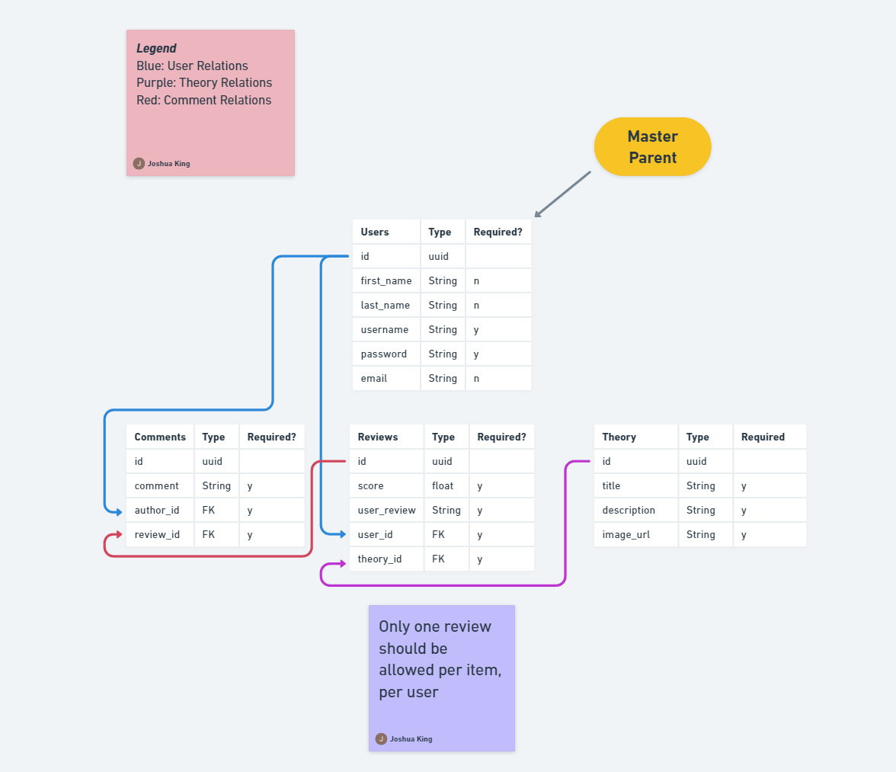
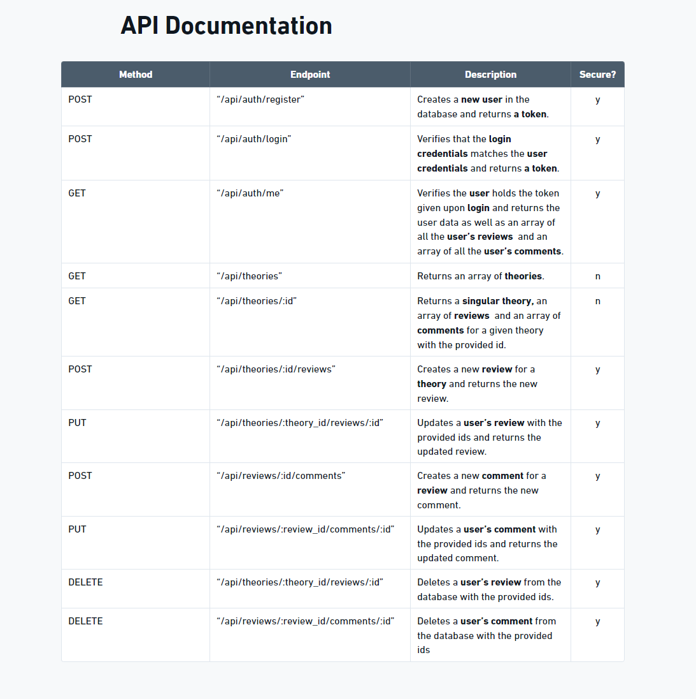

# Unit4.CareerSimulation

## Overview

This is the Unit 4 Career Simulation which builds an API from scratch and prepares it for front-end development.
Below is the database schema and API documentation that we will refer to in order to build the API.

Refer to the [Project Repo](https://github.com/users/JoshKing1219/projects/5) to see the breakdown on the steps taken to build this API.

## Instructions

In this Career Simulation, Calliope asks you to create the back end of a review site for one of Fullstack Solutions' clients. After the back end has been completed, the client will review and provide feedback for improvement before starting the front end at a later time.

In order for you to have a full understanding of the full stack application, review the following requirements for each user experience:

AS A USER (NOT LOGGED IN), I SHOULD BE ABLE TO:

- Access the website via the Internet so I can browse and read reviews.
- View details for a specific reviewed item (store, restaurant, product, book, etc.)
  - I should be able to see the item’s average score or rating.
  - I should be able to see any relevant information about the item.
- Search for specific items, so I can see their scores and read reviews about them.
- Sign up for an account so I can have a logged-in experience.
- Log in to the site if I already have an account.

AS A LOGGED-IN USER, I SHOULD BE ABLE TO:

- Write and submit a review for an item that includes:
  - A written text review
  - A score/rating
  - Only one review should be allowed per item, per user
- View a list of all reviews I have written.
- Delete reviews I have written.
- Edit reviews I have written.
  - Change the text review.
  - Modify the score/rating.
- Write comments on reviews written by others.
- View a list of all comments I have written.
- Edit and delete my comments.
